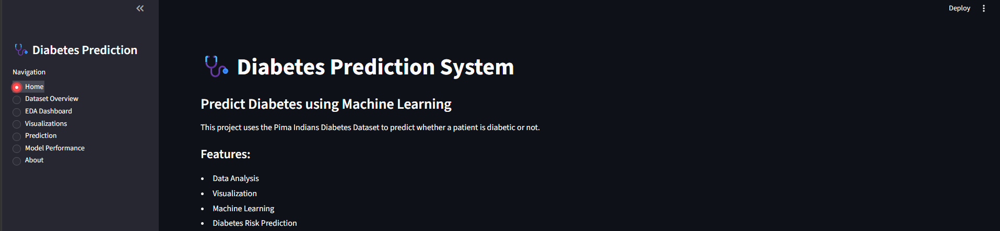
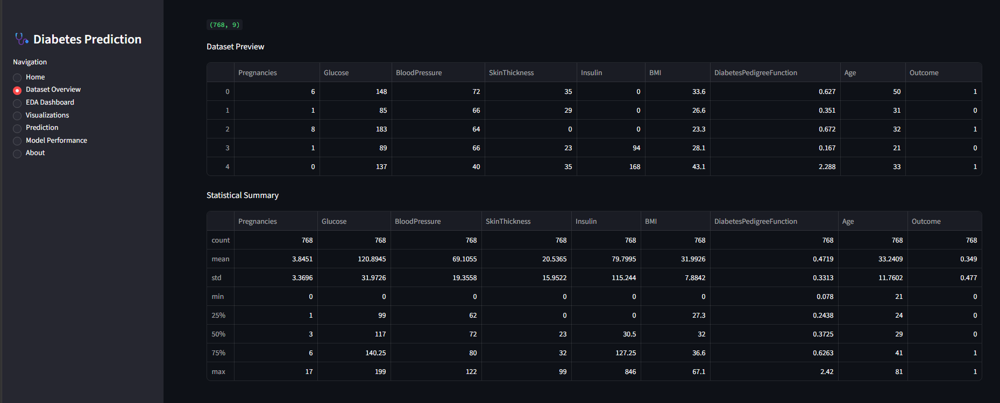
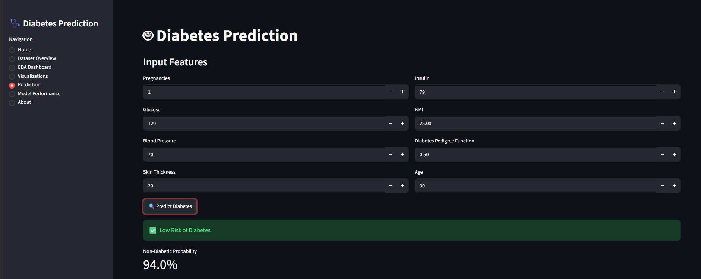
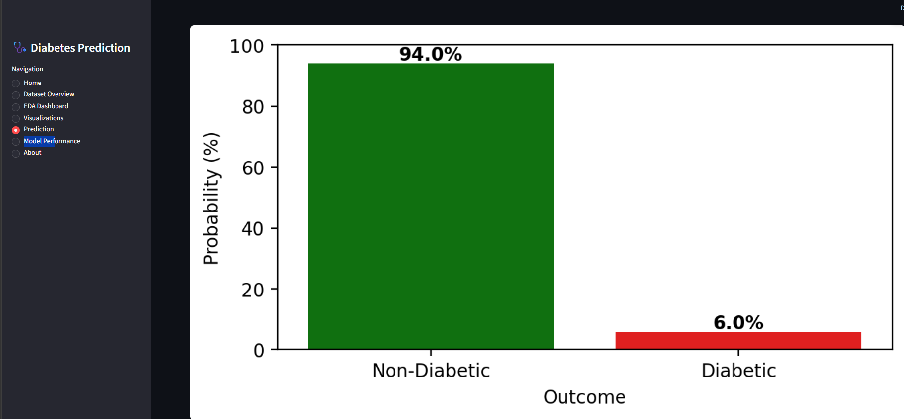

# 🩺 Diabetes Prediction System using Machine Learning

An end-to-end Machine Learning and Data Analytics project built on the Pima Indians Diabetes Dataset. This project combines Exploratory Data Analysis (EDA), Feature Engineering, Machine Learning, and an Interactive Streamlit Web Application to predict diabetes risk in real time.

---

## 🚀 Live Application Features

### 🏠 Home Page

* Project overview and introduction
* Key application features
* Interactive user interface

### 📊 Dataset Overview

* Dataset preview
* Statistical summary
* Feature descriptions
* Data exploration insights

### 📈 EDA Dashboard

* Missing value analysis
* Outlier detection
* Correlation analysis
* Feature engineering insights

### 📉 Visualizations

* Feature distributions
* Diabetes outcome analysis
* Correlation heatmaps
* Interactive charts and plots

### 🤖 Diabetes Prediction

Users can enter:

* Pregnancies
* Glucose
* Blood Pressure
* Skin Thickness
* Insulin
* BMI
* Diabetes Pedigree Function
* Age

The system provides:

✅ Diabetes Risk Prediction
✅ Probability Score
✅ Risk Classification
✅ Prediction Confidence Visualization

### 📋 Model Performance

* Accuracy comparison of multiple ML models
* Hyperparameter tuning results
* Performance metrics evaluation

### ℹ️ About

* Project details
* Technologies used
* Development information

---

## 📸 Application Screenshots

### Home Page



### Dataset Overview



### Prediction System



### Prediction Confidence


---

## 🛠️ Technologies Used

### Programming & Analytics

* Python
* Pandas
* NumPy

### Data Visualization

* Matplotlib
* Seaborn
* Plotly

### Machine Learning

* Scikit-Learn
* XGBoost
* LightGBM

### Web Application

* Streamlit

### Development Tools

* Jupyter Notebook
* Git
* GitHub

---

## 📊 Machine Learning Models Evaluated

| Model               | Accuracy   |
| ------------------- | ---------- |
| Logistic Regression | 87.31%     |
| KNN                 | 86.16%     |
| CART                | 86.15%     |
| Random Forest       | 88.28%     |
| GBM                 | 88.93%     |
| XGBoost             | 89.74%     |
| LightGBM            | **90.07%** |

---

## 🎯 Key Achievements

* Built an end-to-end ML pipeline.
* Performed feature engineering and data preprocessing.
* Improved baseline performance significantly.
* Developed a complete Streamlit dashboard.
* Implemented real-time diabetes prediction.
* Added probability-based confidence visualization.
* Compared and optimized multiple machine learning models.

---

## ▶️ Run Locally

```bash
pip install -r requirements.txt
streamlit run app.py
```

---

## 📄 Dataset

Pima Indians Diabetes Dataset

Source:
https://www.kaggle.com/datasets/uciml/pima-indians-diabetes-database

---

## 👨‍💻 Author

Vishal Yadav

Data Analytics | Machine Learning | Business Intelligence

GitHub:
https://github.com/Vishal123-tech
